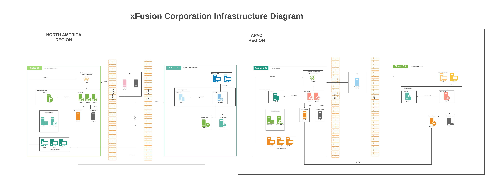

## System Administration Tasks in KodeKloud Engineer Platform

 [KodeKloud Engineer](https://www.kodekloud-engineer.com/) is a free platform designed to impact work experience for IT professionals.

 In this repository, I document the daily tasks that I solve within the platform. 

 I got the idea while on my 35th task, and I have no way of recreating those past 35 tasks, therefore in this repository I'll pick up from task 36 onwards.

 Nautilus Deployment Architecture              |  
:-------------------------:|

### Sections

1. [Linux Bash Scripts]( https://github.com/fred-juma/Kodekloud-Engineer-Tasks/tree/main/KodeKloud%20System%20Administrator/01.%20Linux%20Bash%20Scripts)

2. [Configure Local Yum repos](https://github.com/fred-juma/Kodekloud-System-Administrator/tree/main/KodeKloud%20System%20Administrator/02.%20Configure%20Local%20Yum%20repos)

3. [Linux Log rotate](https://github.com/fred-juma/Kodekloud-System-Administrator/tree/main/KodeKloud%20System%20Administrator/03.%20Linux%20LogRotate)

4. [Linux Postfix Mail Server](https://github.com/fred-juma/Kodekloud-System-Administrator/tree/main/KodeKloud%20System%20Administrator/04.%20Linux%20Postfix%20Mail%20Server)

5. [PAM Authentication for apache](https://github.com/fred-juma/Kodekloud-Engineer-Tasks/tree/main/KodeKloud%20System%20Administrator/05.%20PAM%20Authentication%20for%20apache)

6. [Linux Process Troubleshooting](https://github.com/fred-juma/Kodekloud-System-Administrator/tree/main/KodeKloud%20System%20Administrator/06.%20Linux%20Process%20Troubleshooting)

7. [Install and Configure iptables](https://github.com/fred-juma/Kodekloud-System-Administrator/tree/main/KodeKloud%20System%20Administrator/07%20-%20Install%20and%20configure%20iptables)

8. [Install and Configure apache tomcat](https://github.com/fred-juma/Kodekloud-Engineer-Tasks/tree/main/KodeKloud%20System%20Administrator/08.%20Install%20and%20configure%20apache%20tomcat)

9. [Install And Configure SFTP](https://github.com/fred-juma/Kodekloud-Engineer-Tasks/tree/main/KodeKloud%20System%20Administrator/09.%20Install%20And%20Configure%20SFTP)

10. [Install and Configure PostgreSQL](https://github.com/fred-juma/Kodekloud-Engineer-Tasks/tree/main/KodeKloud%20System%20Administrator/10.%20Install%20and%20Configure%20PostgreSQL)

11. [Install a package](https://github.com/fred-juma/Kodekloud-Engineer-Tasks/tree/main/KodeKloud%20System%20Administrator/11.%20Install%20a%20package)

12. [Linux string substitution with sed](https://github.com/fred-juma/Kodekloud-Engineer-Tasks/tree/main/KodeKloud%20System%20Administrator/12.%20Linux%20string%20substitute%20sed)

13. [Linux Banner](https://github.com/fred-juma/Kodekloud-Engineer-Tasks/tree/main/KodeKloud%20System%20Administrator/13.%20Linux%20Banner)

14. [Deployment in Kubernetes Cluster ](https://github.com/fred-juma/Kodekloud-Engineer-Tasks/tree/main/kodekloud%20DevOps%20Engineer/01.%20Create%20Deployments%20in%20Kubernetes%20Cluster)

15. [Puppet setup NTP Server](https://github.com/fred-juma/Kodekloud-Engineer-Tasks/blob/main/kodekloud%20DevOps%20Engineer/02.%20Puppet%20Setup%20NTP%20Server/puppet%20setup%20ntp%20server.md)

16. [Kubernetes Deployment with Rolling Updates](https://github.com/fred-juma/Kodekloud-Engineer-Tasks/tree/main/kodekloud%20DevOps%20Engineer/03.%20Kubernetes%20Deployment%20and%20Rolling%20Updates)

17. [Puppet deploy file resource](https://github.com/fred-juma/Kodekloud-Engineer-Tasks/tree/main/kodekloud%20DevOps%20Engineer/04.%20Puppet%20deploy%20file%20resource)

18. [Deploy Grafana on Kubernetes Cluster](https://github.com/fred-juma/Kodekloud-Engineer-Tasks/tree/main/kodekloud%20DevOps%20Engineer/05.%20Deploy%20Grafana%20on%20Kubernetes%20Cluster)

19. [Docker copy operations](https://github.com/fred-juma/Kodekloud-Engineer-Tasks/tree/main/kodekloud%20DevOps%20Engineer/06.%20Docker%20copy%20operations)

20. [Setup Puppet Certs](https://github.com/fred-juma/Kodekloud-Engineer-Tasks/tree/main/kodekloud%20DevOps%20Engineer/07.%20Setup%20Puppet%20Certs)

21. [Docker ports mapping](https://github.com/fred-juma/Kodekloud-Engineer-Tasks/tree/main/kodekloud%20DevOps%20Engineer/08.%20Docker%20Ports%20Mapping)

22. [Deploy Jenkins on Kubernetes](https://github.com/fred-juma/Kodekloud-Engineer-Tasks/tree/main/kodekloud%20DevOps%20Engineer/09.%20Deploy%20Jenkins%20on%20Kubernetes)

23. [Ansible Inventory Update](https://github.com/fred-juma/Kodekloud-Engineer-Tasks/tree/main/kodekloud%20DevOps%20Engineer/10.%20Ansible%20Inventory%20Update)