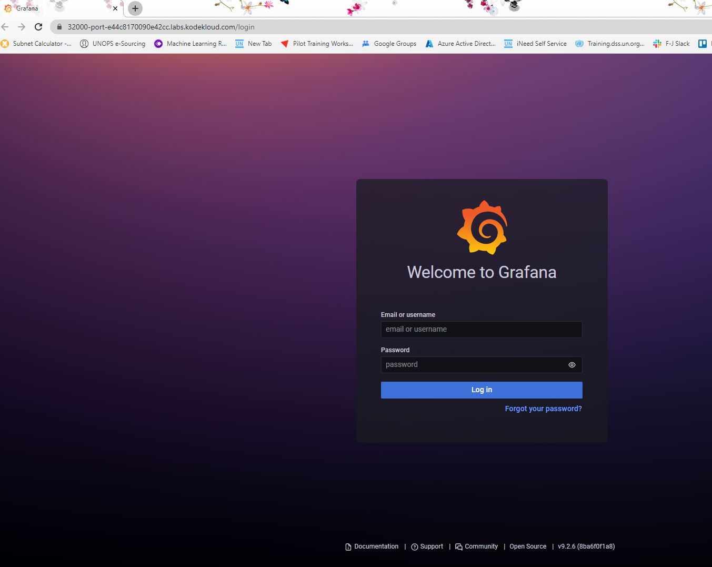

#### Instructions

The Nautilus DevOps teams is planning to set up a *Grafana* tool to collect and analyze analytics from some applications. They are planning to deploy it on Kubernetes cluster. Below you can find more details.


1.) Create a deployment named *grafana-deployment-nautilus* using any grafana image for Grafana app. Set other parameters as per your choice.

2.) Create *NodePort* type *service* with *nodePort 32000* to expose the app.

You need not to make any configuration changes inside the *Grafana* app once deployed, just make sure you are able to access the Grafana login page.

Note: The *kubectl* on *jump_host* has been configured to work with kubernetes cluster.


#### Solution

#### Create the deployment manifest file
```bash
thor@jump_host ~$ kubectl create deployment grafana-deployment-nautilus --image=grafana/grafana --dry-run=client -o yaml > grafana-deployment.yaml
```

#### Using vi text editor, make any necessary configuration changes on the deployment yaml file, content of the file is [here](grafana-deployment.yaml)

```bash
thor@jump_host ~$ vi grafana-deployment.yaml 
````
       
#### Apply the deployment file to create the deployment resource
```bash
thor@jump_host ~$ kubectl apply -f grafana-deployment.yaml 
deployment.apps/grafana-deployment-nautilus created
thor@jump_host ~$ 
```

#### View the created resources including deployment, replicaSet and pod.
```bash
thor@jump_host ~$ kubectl get all -o wide
NAME                                              READY   STATUS    RESTARTS   AGE   IP           NODE                      NOMINATED NODE   READINESS GATES
pod/grafana-deployment-nautilus-7f67f4c49-6759t   1/1     Running   0          28s   10.244.0.5   kodekloud-control-plane   <none>           <none>

NAME                 TYPE        CLUSTER-IP   EXTERNAL-IP   PORT(S)   AGE    SELECTOR
service/kubernetes   ClusterIP   10.96.0.1    <none>        443/TCP   102m   <none>

NAME                                          READY   UP-TO-DATE   AVAILABLE   AGE   CONTAINERS   IMAGES            SELECTOR
deployment.apps/grafana-deployment-nautilus   1/1     1            1           28s   grafana      grafana/grafana   app=grafana-deployment-nautilus

NAME                                                    DESIRED   CURRENT   READY   AGE   CONTAINERS   IMAGES            SELECTOR
replicaset.apps/grafana-deployment-nautilus-7f67f4c49   1         1         1       28s   grafana      grafana/grafana   app=grafana-deployment-nautilus,pod-template-hash=7f67f4c49
thor@jump_host ~$ 
```

#### Next, create the grafana service manifest file

```bash

thor@jump_host ~$ kubectl expose deployment grafana-deployment-nautilus --type=NodePort  --port=3000 --name=grafana-service --dry-run=client -o yaml > grafana-service.yaml
thor@jump_host ~$ 
```

#### Using vi text editor, apply the specified configurations on the manifest yaml file, find a copy [here](grafana-service.yaml)

```bash
thor@jump_host ~$ sudo vi grafana-service.yaml 
```

#### Apply the configuration file to create the service resource.

```bash

thor@jump_host ~$ kubectl apply -f grafana-service.yaml 
service/grafana-service created
thor@jump_host ~$ 
```

#### Browse to the grafana homepage to confirm the app was successfully deployed

Grafana Home Page              |  
:-------------------------:|

